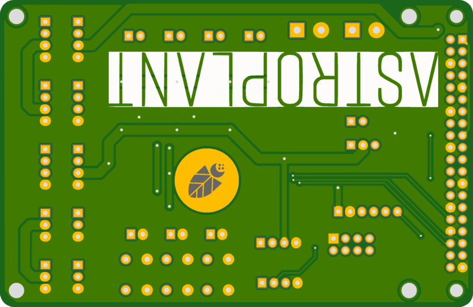

# Astroplant Extension Board MK0.6

## About This Project

[Interactive BOM](http://htmlpreview.github.io/?https://github.com/VincentFrangi/astroplant-extension-board-mk0-6/blob/master/ibom.html)

## Renderings

### Top

### Bottom

## BOM

|Count|Component|Details|Datasheet|
|-|-|-|-|
|2x|C1 / C2|CAP CER 0.1UF 25V X7R 0805|[Link](http://datasheets.avx.com/X7RDielectric.pdf)|
|1x|C4|CAP ALUM POLY 470UF 20% 25V SMD|[Link](https://industrial.panasonic.com/cdbs/www-data/pdf/RDD0000/ABA0000C1229.pdf)|
|1x|C3|CAP ALUM POLY 470UF 20% 6.3V SMD|[Link](https://katalog.we-online.de/pbs/datasheet/875115150005.pdf)|
|1x|D1|LED BLUE ESS II SMD|[Link](https://industrial.panasonic.com/content/data/SC/ds/ds4/LNJ937W8CRA_E.pdf)|
|3x|D2 / D3 / D4|DIODE GEN PURP 50V 1A SMA|[Link](http://www.smc-diodes.com/propdf/S1A-S1M%20N0560%20REV.B.pdf)|
|1x|D5|LED AMBER ESS II SMD|[Link](https://industrial.panasonic.com/content/data/SC/ds/ds4/LNJ437W84RA_E.pdf)|
|1x|J1|CONN HEADER XH TOP 6POS 2.5MM|[Link](http://www.jst-mfg.com/product/pdf/eng/eXH.pdf)|
|9x|J10 / J12 / J22 / J23 / J24 / J25 / J26 / J27 / J6|CONN HEADER XH TOP 4POS 2.5MM|[Link](http://www.jst-mfg.com/product/pdf/eng/eXH.pdf)|
|1x|J2|CONN HEADER VERT 40POS 2.54|[Link](http://katalog.we-online.de/em/datasheet/6130xx21121.pdf)|
|2x|J20 / J21|TERM BLOCK 5.08MM VERT 2POS PCB|[Link](http://www.on-shore.com/wp-content/uploads/2015/09/OSTTAXX4163.pdf)|
|7x|J11 / J16 / J17 / J18 / J19 / J5 / J8|CONN HEADER XH TOP 2POS 2.5MM|[Link](http://www.jst-mfg.com/product/pdf/eng/eXH.pdf)|
|4x|J3 / J4 / J7 / J9|CONN HEADER XH TOP 3POS 2.5MM|[Link](http://www.jst-mfg.com/product/pdf/eng/eXH.pdf)|
|1x|JP1|CONN HEADER 3 POS 2.54|[Link](http://katalog.we-online.de/em/datasheet/6130xx11121.pdf)|
|1x|JP2|CONN HEADER 2 POS 2.54|[Link](http://katalog.we-online.de/em/datasheet/6130xx11121.pdf)|
|5x|Q1 / Q2 / Q3 / Q4 / Q5|MOSFET N-CH 30V 5A SOT23|[Link](http://www.infineon.com/dgdl/irlml6344pbf.pdf?fileId=5546d462533600a4015356689c44262c)|
|1x|R11|RES SMD 180 OHM 5% 0.4W 0805|[Link](https://www.rohm.com/datasheet/ESR01MZPF/esr-e)|
|1x|R6|RES SMD 27 OHM 0.5% 1/16W 0603|[Link](http://www.susumu.co.jp/common/pdf/n_catalog_partition05_en.pdf)|
|6x|R1 / R2 / R3 / R4 / R5 / R7|RES SMD 10K OHM 0.5% 1/10W 0805|[Link](http://www.susumu.co.jp/common/pdf/n_catalog_partition05_en.pdf)|
|3x|R10 / R8 / R9|RES SMD 100K OHM 0.1% 1/8W 0805|[Link](http://www.susumu.co.jp/common/pdf/n_catalog_partition01_en.pdf)|
|3x|SW1 / SW2 / SW3|SWITCH TACTILE SPST-NO 0.02A 15V|[Link](https://www3.panasonic.biz/ac/e_download/control/switch/light-touch/catalog/sw_lt_eng_5n.pdf)|

---

This project is managed and available on

You can view it [here](https://aisler.net/p/DBKSBTQF). Start your own Powerful Prototype on [here](https://aisler.net).
